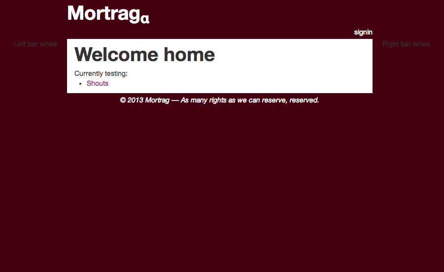

# Mortrag on Ruby on Rails

The first alpha of code for the next Mortrag website. Never finished.

## History

### Past websites
There was a long history of Mortrag websites, including
* Yahoo! Geocities: WYSIWYG editor with a smidgen of custom HTML
* Google Pages: raw HTML, before Google disallowed this and switched to Google Sites
* mortrag.com: a PHP implementation with functionality for users to log in and post content, and admin users to create sections of the website. A somewhat fleshed-out video games section that allowed posting reviews, screenshots, files, and videos, with additional sections for art, music, and anything more.
* mortrag.com v2.0: a Rails implementation (what you see here)

Each version was never finished before the next was begun. Rails seemed like it had the power to provide a platform for truly extend-able content because of the MVC framework and amazing power of Ruby and Rails to craft a concise DSL. It's a shame we didn't start with it :-)

### Why did it fail?
The goal of Mortrag was always to provide a platform for its small community to display the work they did on their many projects online, be it writing about video games, making art, building computers, boffering, or whatever they were interested in.

However, with only one web developer ever, and only one other member who was involved, the project saw extreme bursts of progress for only a few weeks or months out of every year, and eventually those involved moved on to other projects. The domain name expired, and things have moved on.

Never having a finished, usable product marred community involvement. It was forever 'in progress,' so no one ever used it.

### How to prevent this?

One thing that was suggested that could have perhaps saved the Mortrag website from this fate was to narrow the focus. However, doing so would eliminate its viability as 'the' platform for users to post content from any activity of their life.

Other things simply didn't exist at the time, like a more viable ecosystem for Rails (tutorials, Heroku), or other platforms that fulfill most of these needs.

In hindsight, it taught me several valuable lessons in software development:

- **Use the most powerful platform available to you.** Rails &gt; PHP &gt; raw HTML. I don't have regrets that I 'moved up' the power ladder as time went on, because I think you learn a lot from reinventing the wheel. (I also was not a programmer when I began so Rails might have been too daunting a task.) However, to make a platform that people use, you can't go from scratch, and you don't need to.

- **Find the smallest core you can that people will use, build it as fast as possible, and release it.** Then build features. Had I started in Rails, and could start over now, I would have built a simple model for people to write posts in Markdown (including pictures) and a field for tags. Then have a home page where you display the posts chronologically. Integrate email / tweets / RSS / whatever so people keep getting updates about what's going on, and if they go to the site, they'll see what happens. After this, start adding more structure, so instead of tags the posts are organized hierarchically into sections.

- **Let contributors see their work.** This is a huge 'duh,' but the biggest problem with the mortrag.com PHP website was that people's posts would be buried under the section / sub-section / sub-sub-section / sub-sub-sub-section (seriously) they posted it in. The one user who actually used it resorted to cross-posting in more visible categories just so anyone could see what he did. 

## Is this code useful?
Probably not! It just contains a couple simple models and views. I spent most of my time learning rails before actually starting this website.

For learning Rails, I tried [Rails for Zombies](http://railsforzombies.com), which was interesting but didn't help me actually grasp what Rails was or what it was doing. I then went through [Michael Hartl's Rails Tutorial Book](http://ruby.railstutorial.org/) (as you can probably tell by my other repositories), but I really didn't like it. Which I hate to say because he put so much work in to it, and I did learn a lot, but 1. it is maddeningly verbose, and 2. the test-driven-development felt fake and unnecessary.

I will say that nearly every feature I learned about Rails blew my mind, because it was something I'd spend hours doing in PHP. It made me realize just how much of what I wrote in PHP was boilerplate and brainless. I think Rails, or any equally or more powerful MVC framework in Node, etc., is the way to go when making a medium+ custom website.

For making a small custom website, static pages are probably enough, and/or [slap a simple Node server on it](http://github.com/mbforbes/prjpages).

For making a small website (custom not needed), just go with wordpress / etc., and save the headache.
